# AWS Threat Detection Lab using GuardDuty, CloudTrail, and SNS

---

## Table of Contents
- [Overview](#overview)
- [Objectives](#objectives)
- [Architecture](#architecture)
- [CloudTrail Logging](#cloudtrail-logging)
- [GuardDuty Threat Detection](#guardduty-threat-detection)
- [IAM Attack Simulation](#iam-attack-simulation)
- [API Activity Simulation](#api-activity-simulation)
- [GuardDuty Findings](#guardduty-findings)
- [SNS Alerting Setup](#sns-alerting-setup)
- [EventBridge Integration](#eventbridge-integration)
- [Alert Validation](#alert-validation)
- [Incident Response and Remediation](#incident-response-and-remediation)
- [Conclusion](#conclusion)

---

## Overview
This project demonstrates the implementation of a cloud threat detection and alerting system in AWS. It simulates suspicious API activity using IAM credentials and detects it using AWS GuardDuty, while logging all actions through CloudTrail. Alerts are automatically delivered via SNS using EventBridge, replicating a real-world cloud security monitoring pipeline.

---

## Objectives
- Enable AWS CloudTrail for activity logging
- Configure GuardDuty for threat detection
- Simulate suspicious API activity using IAM credentials
- Detect threats through GuardDuty findings
- Implement real-time alerting using SNS and EventBridge
- Demonstrate incident response and remediation practices

---

## Architecture
The following AWS services were used in this project:

- **CloudTrail** → Logs all API activity
- **GuardDuty** → Detects suspicious behavior
- **IAM** → Simulates attacker credentials
- **CloudShell (CLI)** → Generates API activity
- **EventBridge** → Routes GuardDuty findings
- **SNS** → Sends real-time email alerts

---

## CloudTrail Logging
AWS CloudTrail was configured to log all management events across the account.

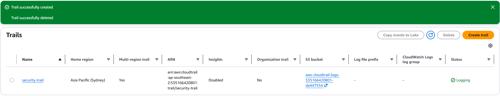

---

## GuardDuty Threat Detection
GuardDuty was enabled to monitor CloudTrail logs and identify suspicious activity.

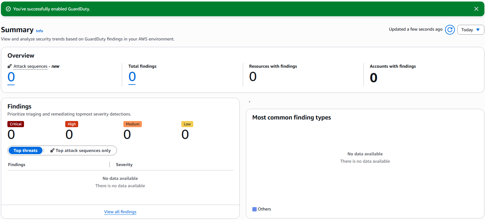

---

## IAM Attack Simulation
A test IAM user (`attacker-user`) was created to simulate a compromised account.

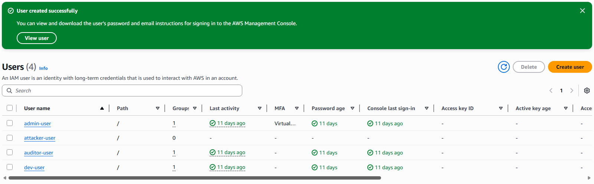

---

## Access Key Creation
An access key was generated to simulate API-based access.

Sensitive credentials have been redacted for security purposes.

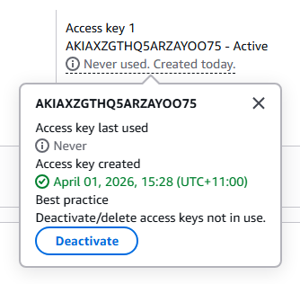

---

## API Activity Simulation
Suspicious API activity was simulated using AWS CLI to mimic attacker-style enumeration and resource discovery.

### Commands used
```bash
aws iam list-users
aws s3 ls
aws ec2 describe-instances
```

Initial suspicious API call:

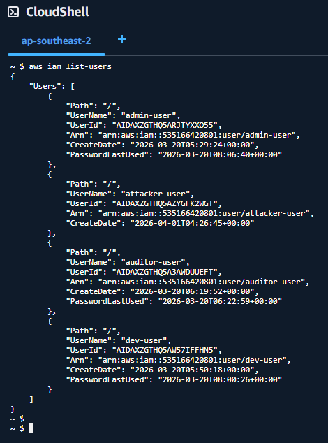

Additional API enumeration activity:

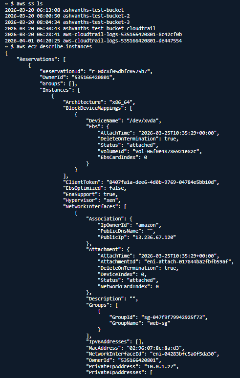

---

## GuardDuty Findings
GuardDuty successfully detected suspicious activity and generated security findings.

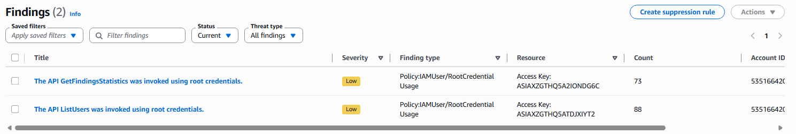

The findings showed that AWS was able to identify unusual or risky API usage patterns, validating that the monitoring and detection pipeline was functioning correctly.

---

## SNS Alerting Setup
An SNS topic was created to support real-time email-based alerting.

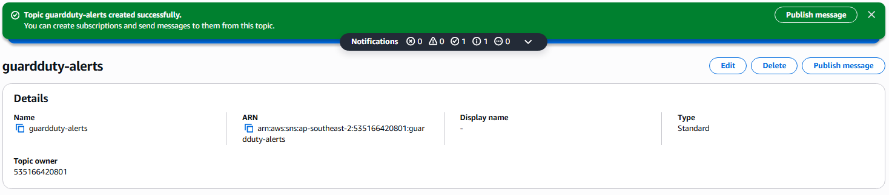

The SNS email subscription was then confirmed successfully.

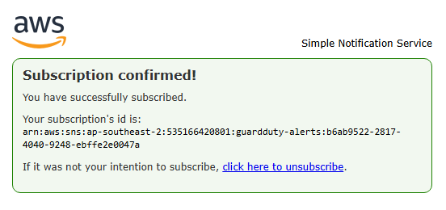

---

## EventBridge Integration
An EventBridge rule was created to route GuardDuty findings directly to the SNS topic, enabling automated alert delivery.

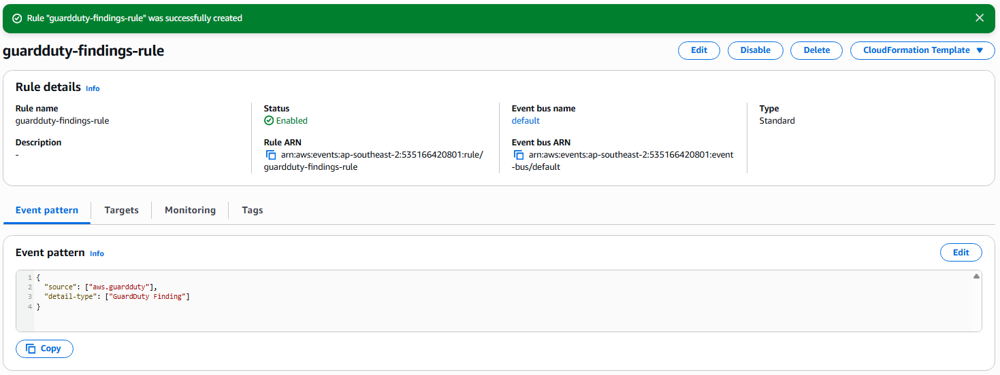

---

## Alert Validation
After generating new GuardDuty findings, an SNS email alert was successfully received. This confirmed that the full monitoring pipeline was working end-to-end.

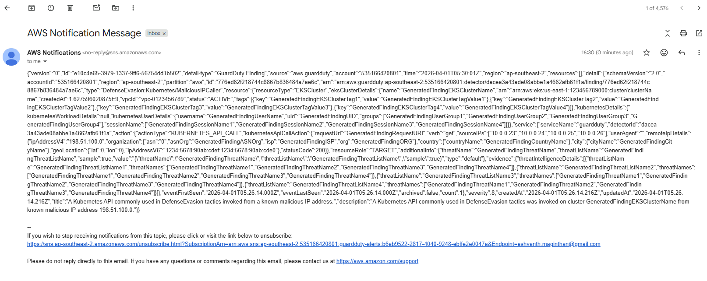

---

## Incident Response and Remediation
Following detection of suspicious activity, the following response process was applied to simulate a real-world cloud security incident workflow.

### Immediate Actions
- Identified the affected IAM user (`attacker-user`) associated with the suspicious activity
- Reviewed GuardDuty findings to understand the alert context and severity
- Disabled or rotated the exposed access key to prevent further unauthorized API usage

### Investigation
- Analyzed CloudTrail logs to trace all actions performed using the credentials
- Reviewed suspicious API calls including:
  - `ListUsers`
  - `DescribeInstances`
  - `ListBuckets`
- Examined metadata from GuardDuty findings such as source details and affected resources

### Containment
- Removed overly permissive access where applicable, including excessive permissions such as `AdministratorAccess`
- Applied the principle of least privilege to reduce unnecessary access
- Verified that no unauthorized resources were created, modified, or deleted

### Recovery
- Replaced insecure credentials with safer access practices
- Enabled MFA for IAM users where relevant
- Confirmed that the environment returned to a secure and stable state

### Prevention and Improvements
- Implemented continuous monitoring using GuardDuty and CloudTrail
- Configured automated alerting using EventBridge and SNS
- Reduced reliance on long-term access keys
- Recommended regular credential rotation and IAM policy auditing
- Improved readiness for future cloud security incidents through better monitoring and response practices

---

## Conclusion
This project demonstrates a complete AWS cloud security workflow covering threat detection, logging, alerting, and incident response. By integrating GuardDuty, CloudTrail, EventBridge, and SNS, a real-time monitoring pipeline was built and successfully validated through simulated suspicious API activity.

The project shows practical understanding of:
- cloud threat detection
- security monitoring
- automated alerting
- IAM security risks
- incident response and remediation

Overall, this project reflects a realistic cloud security use case and serves as a strong hands-on portfolio piece for cloud security and cybersecurity-focused roles.

---
